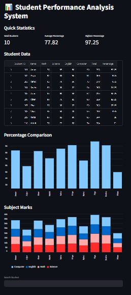
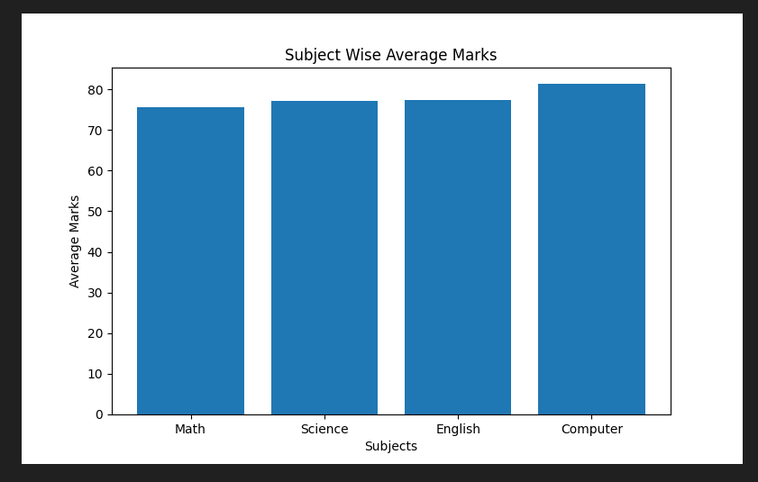
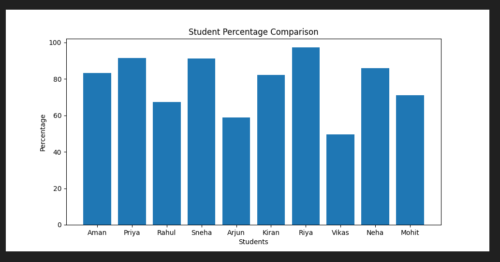

# Student Performance Analysis System

## Overview

A Python-based data analytics project that analyzes student academic performance using Pandas and visualizes insights through charts and a Streamlit dashboard.

## Features

* Read student data from CSV files
* Data cleaning and preprocessing
* Missing value and duplicate handling
* Total marks and percentage calculation
* Grade assignment
* Topper identification
* Weak student detection
* Subject-wise performance analysis
* Automated report generation
* Interactive Streamlit dashboard
* Data visualization using Matplotlib

## Technologies Used

* Python
* Pandas
* NumPy
* Matplotlib
* Streamlit

## Project Structure

Student_Performance_Analysis/
├── data/
├── charts/
├── reports/
├── main.py
├── dashboard.py
├── requirements.txt

## How to Run

1. Install dependencies:

pip install -r requirements.txt

2. Run analysis:

python main.py

3. Run dashboard:

streamlit run dashboard.py

## Sample Outputs

* Subject Average Chart
* Student Performance Chart
* Report Generation
* Interactive Dashboard

# Student Performance Analysis System

## Dashboard

## Subject Analysis

## Student Performance

